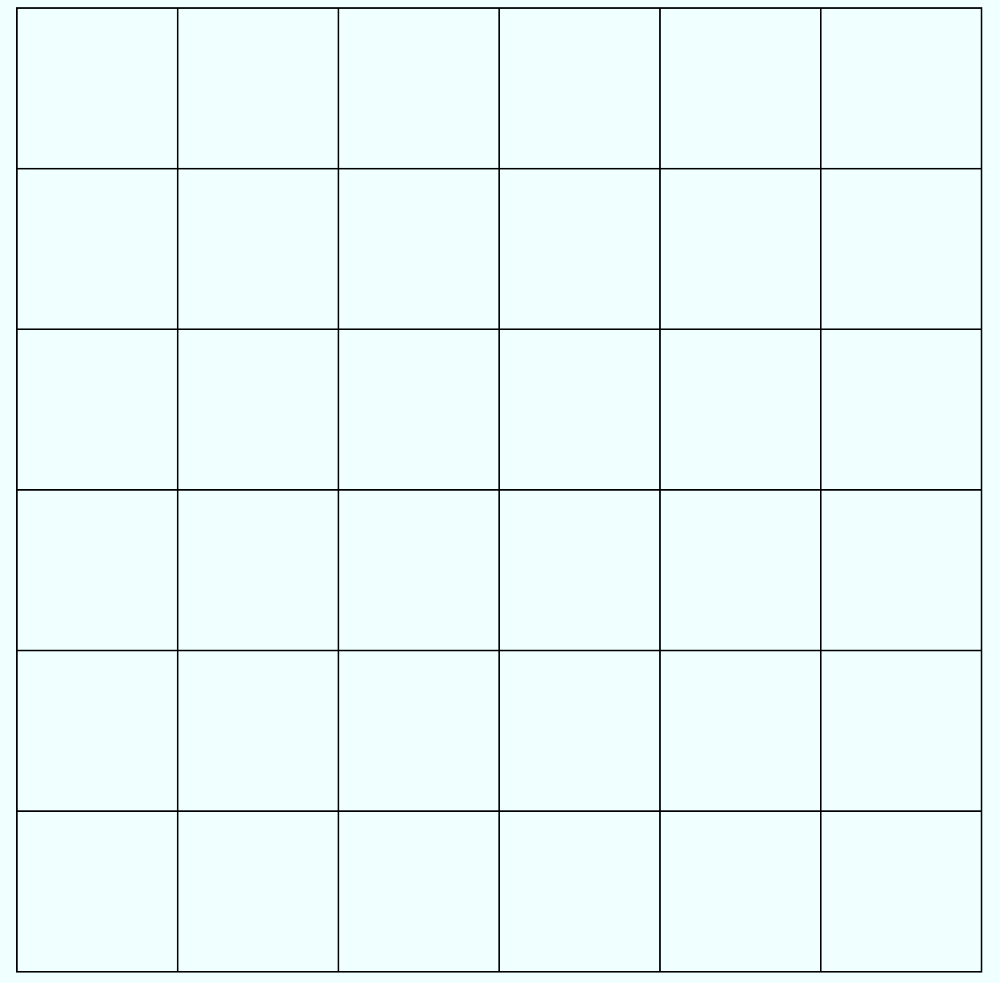
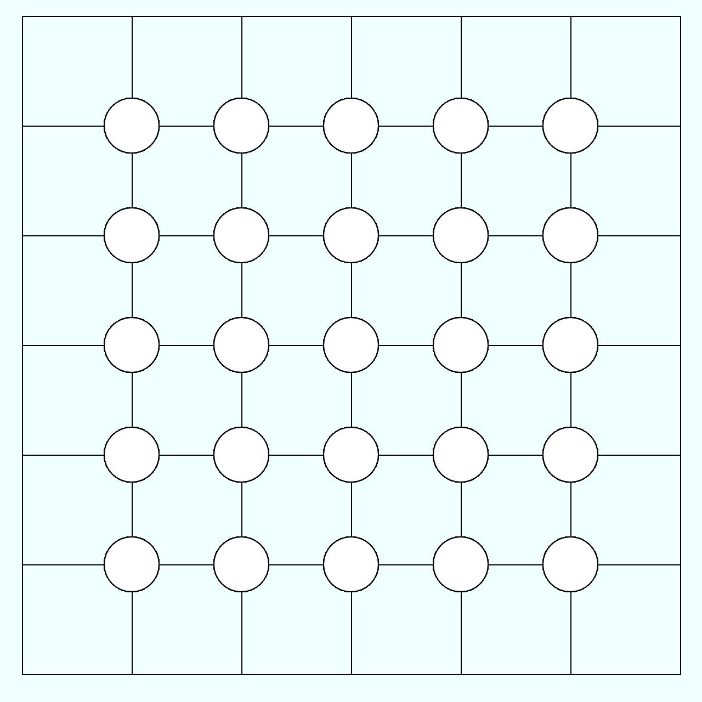
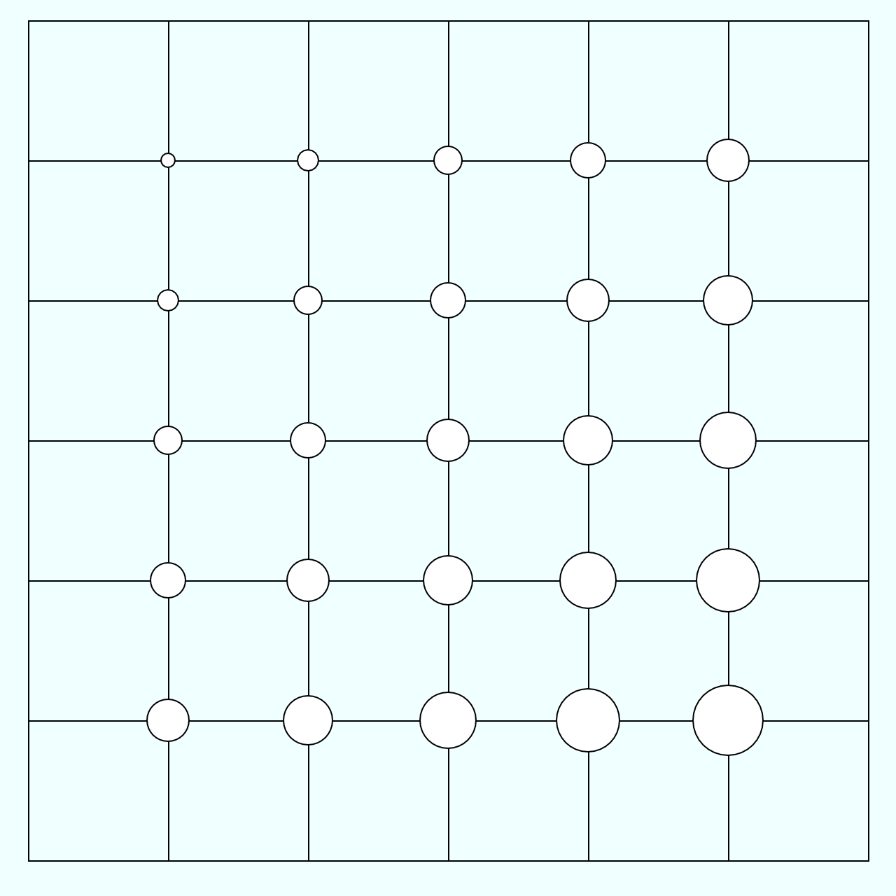
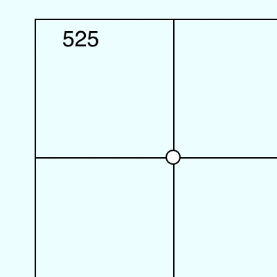
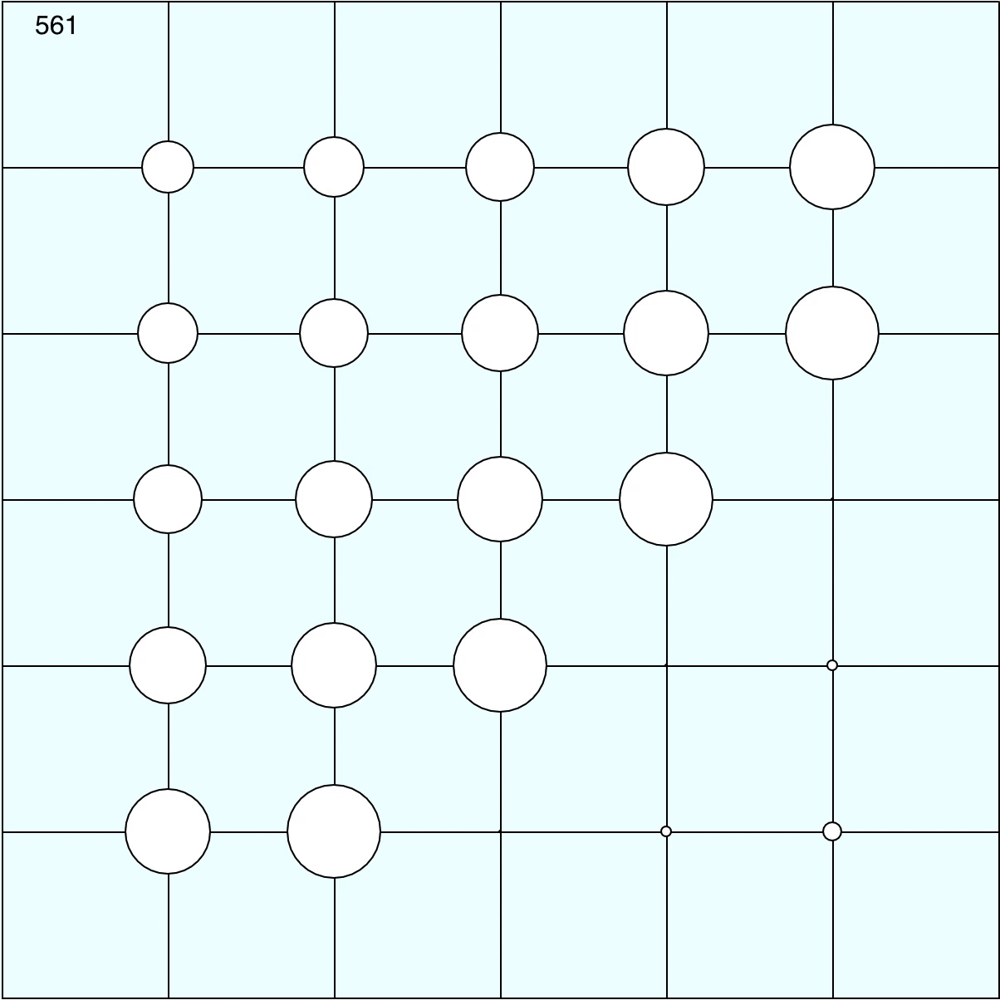
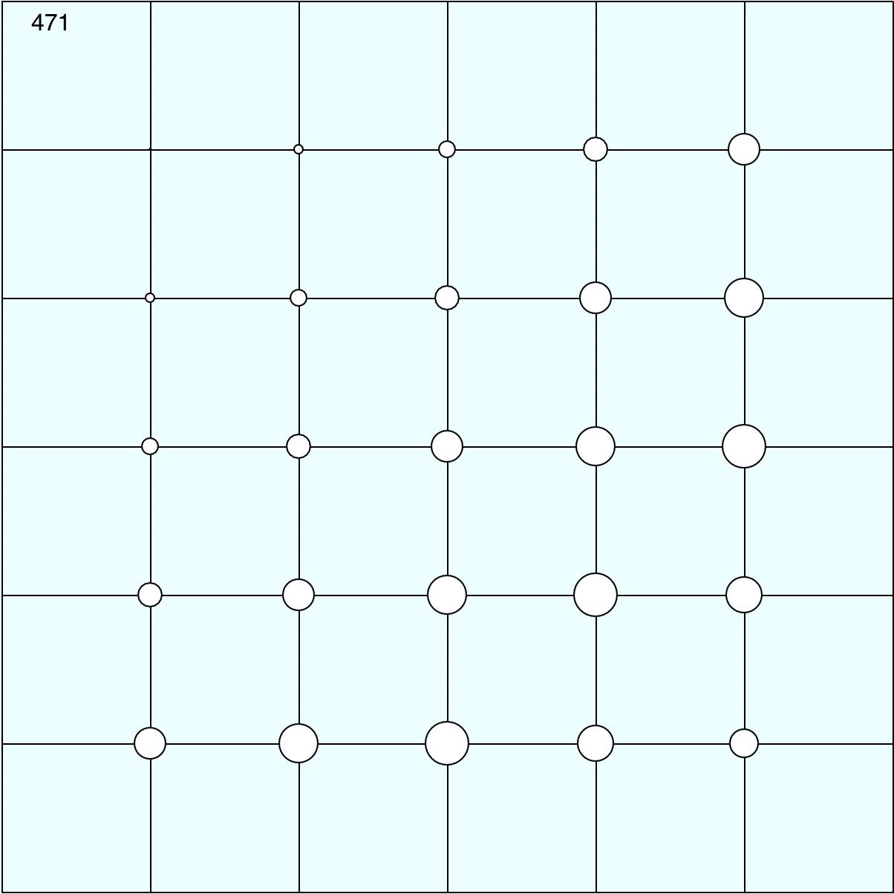

주의:  이 글은 어디까지나 초보자의 입장에서 다른 초보자들을 위해 공유하는 작업 일지입니다. 설명은 [https://p5js.org/reference](https://p5js.org/reference) 에 기반해서 작성했으나, 틀린 내용이 있을 수 있기 때문에 혹시라도 발견하게 된다면 mididice@gmail.com 으로 알려주세요.

# 배경

---

CodePen 혹은 트위터에서 인터랙티브한 웹 작업물을 만드는 사람들을 많이 팔로우하는 편이다. 그러던 도중 반복되는 애니메이션이나 사운드 관련 작업을 주로 p5.js로 만든다는 것을 알게 되었다. p5.js는 아티스트와 디자이너 등도 인터랙티브한 미디어 작업을 웹상에서 쉽게 코드로 구현할 수 있도록 도와주는 자바스크립트 라이브러리이다. 재밌게 따라할 수 있는 튜토리얼이 많으며(대부분 영문이지만), 코드를 짜는 도중에도 여러가지 실험 및 변형이 쉽다. 목표의식을 갖고 p5.js 활용을 공부해볼 겸, p5.js로 반복되는 이미지를 만들어보기로 했다. 

# 참고할 만한 사람들과 링크(영문)

---

- [https://twitter.com/beesandbombs](https://twitter.com/beesandbombs)
    - 이 글을 쓰는데 많은 영향을 끼친 트위터 계정이다. 더블린 기반의 아티스트 Dave Whyte의 트위터 계정으로, 주로 p5.js를 이용한 모션그래픽 GIF를 활발하게 업로드한다. 인스타그램, 텀블러, 드리블 에서도 작업을 볼 수 있다.
- [https://www.youtube.com/user/shiffman](https://www.youtube.com/user/shiffman)
    - Daniel Shiffman의 유튜브 채널. 전반적인 프로세싱 튜토리얼 강의들이 있으며 라이브 방송을 많이 한다. 영어로 되어있지만 초심자도 쉽게 알아들을 수 있도록 굉장히 재미있게 강의한다. 따라할 수 있는 예제들이 굉장히 많다.
- [https://generativeartistry.com/](https://generativeartistry.com/)
    - Tim Holman이 만든 Generative art 관련 튜토리얼들이 있는 웹사이트이다. 코드의 변화에 따라 예제가 구체적으로 어떻게 구현되는지 잘 설명되어 있다.
- [http://p5js.org/](http://p5js.org/)
    - p5.js의 공식 문서.
- [https://www.openprocessing.org/](https://www.openprocessing.org/)
    - p5.js 웹 IDE이다. 다른 사람들의 작업과 코드 또한 볼 수 있다.
- 그 외에도 아마존에서 generative art, p5.js, algorithmic art로 검색하면 양질의 튜토리얼 e-book들이 꽤 많이 나와있는 편이다.

# 구상하기

---

대충 낙서처럼 어떤 걸 만들고 싶은지 그려봤다. 하고 싶은게 많지만 너무 복잡한 것은 피했다.

p5.js의 장점은 작업하는 도중 이것저것 대입하거나 섞어보면서 실험하기가 쉽다는 것이다. 그래서 코드를 짜기 전 너무 구체적인 계획을 짜는 대신 대략적인 구상만 정해놓았다. 흔히 볼 수 있는, 원들이 커졌다가 작아지기를 반복하는 패턴을 만들기로 했다. 이외의 세부적인 사항은 코드를 짜면서 추가하거나 수정하기로 했다. 

# 구현하기

---

## 도형 그리기

1. [openprocessing.org](http://openprocessing.org) 에서 p5.js의 웹 IDE를 이용할 수 있다. 가입을 하지 않아도 IDE는 쓸 수 있다. openprocessing 이외에도 [codepen.io](http://codepen.io) 에서도 p5.js를 사용할 수 있지만, GIF로 export 하는 기능을 지원해주기 때문에 그냥 openprocessing 을 사용해보았다.

2. openprocessing에서 Create a sketch로 새 문서를 만들면 아래와 같은 예제 코드를 볼 수 있다. `setup()` 내에 들어가는 내용은 웹 페이지가 시작할 때 한번만 실행되며 주로 canvas 크기, 도형의 속성 등의 내용을 지정할 수 있다. 반면 `draw()` 안에 들어가는 내용의 경우 1초에 지정된 횟수(기본값은 초당 60회, 즉 60프레임)만큼 반복된다. 예제를 실행해 보면 마우스 커서를 따라다니면서 동그라미들이 1초에 60회씩 생성되는 것을 볼 수 있다.

        function setup() {
        	createCanvas(windowWidth, windowHeight);
        	background(100);
        
        }
        function draw() {
        	ellipse(mouseX, mouseY, 20, 20);
        }

    새 작업을 만들기 위해 안의 내용을 모두 지우고, 아래와 같이 createCanvas 만 601*601 사이즈로 남겨놓았다. `createCanvas(x,y)`는 도형을 그릴 작업 영역의 크기를 가로 x, 세로 y 크기로 지정해주는 함수이다. 캔버스 위에 그릴 도형과 배경의 헷갈림을 방지하기 위해 `background("azure")`로 배경색을 바꿨다. 

        function setup() {
        	createCanvas(601, 601);
        }
        
        function draw() {
        	background("azure");
        }

    *참고: `background()`를 `setup()`이 아닌 `draw()`안에 넣는 이유는, 시작할 때 한번만 배경색을 파랗게 칠하고 끝나는 것이 아니라 다음 프레임으로 넘어갈 때마다 계속 배경색을 파랗게 칠해줌으로써 이전 프레임에서 그린 도형 위에 배경을 덮어씌워주는 역할을 해주기 때문이다. 이렇게 하지 않으면 이전 프레임에서의 도형의 잔상이 계속 캔버스 위에 남게 된다.*

3. 원래 격자무늬를 만드려던 건 아니었지만 시각적으로 선을 그어주는 게 헷갈리지 않고 나중에 실험하기도 좋을 것 같아서 먼저 **가로세로 7줄의 격자**를 그려보기로 했다. `line(x1,y1,x2,y2)` 는 (x1,y1) 부터 (x2,y2) 까지 선을 긋는 함수이다. 

        function setup() {
        	createCanvas(601, 601);
        }
        
        function draw() {
        	background("azure");
        	//draw 7x7 grid
        	//vertical line
        	for(k=0;k<7;k++) {
        		line(k*100,0,k*100,600);
        		}
        	//horizontal line
        	for(k=0;k<7;k++) {
        		line(0,k*100,600,k*100);
        		}
        }

    

4. **격자의 교차점에 원 25개를** 그린다. `ellipse(x,y,w,h)`는 (x,y) 좌표에 가로 w, 세로 h 크기의 원(타원)을 그려주는 함수이다. 주의해야 할 점은 x,y는 기본적으로 원(타원)의 가운데 좌표를 의미한다는 것이다. `fill("white")` 로 도형에 채울 색을 지정한 이후에  `ellipse()` 로 원을 그린다. 

        function setup() {
        	createCanvas(601, 601);
        }
        
        function draw() {
        	background("azure");
        	//draw 7x7 grid
        	//vertical line
        		for(k=0;k<7;k++) {
        			line(k*100,0,k*100,600);
        			}
        	//horizontal line
        		for(k=0;k<7;k++) {
        			line(0,k*100,600,k*100);
        			}
        	
        	//draw 25 circles 
        	fill("white");
        	for (i=1;i<6;i++) {
        		for (k=1;k<6;k++) {
        			ellipse(k*100,i*100,50,50);
        		}
        	}
        }

    

    5. `ellipse(k*100,i*100,50,50)` 로 반지름 50의 원을 25개 그렸다. 여기서 원의 크기가 똑같지 않고 **좌표에 따라 달라지도록** 반지름을 `(i+k)` 로 변경해보면 다음과 같은 모양이 만들어진다. 원이 너무 작은 것 같아 `5*(i+k)` 로 바꿨는데, 이처럼 도형을 만들 때 **숫자를 계속 바꿔보면서 크기를 조정**하면 좋다.

    

## 애니메이션 만들기

1. `ellipse()` 원을 그렸다. 하지만 목표는 원의 크기가 점점 커졌다가 작아지는 것이기 때문에 원의 크기를 변화시켜야 한다. 앞서 말했듯이 `draw()`는 1초에 지정된 횟수(기본값 60회)만큼 안의 내용을 무한루프로 반복해서 실행하기 때문에 이를 이용하여 **시간의 흐름에 따라 애니메이션을 만들 수 있다.**
먼저 이해를 돕기 위해, 바깥에서 `count`라는 변수를 선언한 후  `draw()` 안에서 `count`가 계속해서 증가하도록 추가해줬다. 아래의 코드를 실행시켜보면 `count`라는 변수가 계속해서 증가하는 것을 화면에서 볼 수 있다. 이는 `draw()`안의 내용물이 **초당 60회의 속도로 계속 반복실행**된다는 것을 시각적으로 보여준다.*참고:  `setup()` 내에서 `frameRate(x)` 를 이용하면 초당 반복 횟수, 즉 프레임을 x회로 변경할 수 있다.*

        var count = 0;
        
        function setup() {
        	createCanvas(601, 601);
        }
        
        function draw() {
        	background("azure");
        	//count frames
        	count += 1;
        	textSize(16);
        	text(count,20,20);
        
        ...
        
        	}

    

2. 이제 `count`를 이용해서 애니메이션을 만들 차례이다. `count`는 계속 증가하기만 하기 때문에 이를 원의 반지름에 그대로 적용하면 원이 무한히 커진다. 반복적인 애니메이션을 만들기 위해 60으로 나눈 나머지인 `count%60`을 원의 반지름에 넣어 원의 반지름 값이 반복되도록 만들었다. 
그러나 `count%60`을 일괄적으로 적용하면 25개의 원이 똑같이 움직이기 때문에 움직임이 단조로워 보인다. 그래서 **원의 움직임이 똑같지 않고 좌표에 따라 달라지도록** `(count+5*(i+k))%60` 을 원의 반지름에 넣어줬다. 헷갈림을 방지하기 위해 `radiusCount` 라는 새로운 변수를 만들어 그 안에 값을 넣어줬다.

        var count = 0;
        
        function setup() {
        	createCanvas(601, 601);
        }
        
        function draw() {
        
        ...
        	
        	//draw 25 circles 
        	for (i=1;i<6;i++) {
        		for (k=1;k<6;k++) {
        			fill("white");
        
        	//change radius according to frame count(count) & coordinates(i+k)
        			var radiusCount = (count+5*(i+k))%60;
        			ellipse(k*100,i*100,radiusCount,radiusCount);
        		}
        	}
        }

    

3. `radiusCount`는 나머지를 이용한다. 그래서 나머지가 0이 되는 순간 원이 커졌다가 갑자기 작아져 움직임이 뚝뚝 끊기고 어색해보인다. 반지름이 증가하다가 서서히 작아지게 만들기 위해 중간에 if문을 추가해서 `radiusCount`가 30보다 크면 감소하게 했다.

        var count = 0;
        ...
        
        function draw() {
        ...
        	//draw 25 circles 
        	for (i=1;i<6;i++) {
        		for (k=1;k<6;k++) {
        			fill("white");
        			var radiusCount = (count+5*(i+k));
        			if (radiusCount > 30) {
        				radiusCount = 60 - radiusCount;
        			}
        			ellipse(k*100,i*100,radiusCount,radiusCount);
        
        		}
        	}
        }

    

4. 목표로 했었던 기본적인 애니메이션을 완성했다. 이제 색상이나 도형의 변화 등을 조절해가며 취향에 따라 애니메이션을 변형할 수 있다. 반복문에 다른 도형을 추가하거나 `random()` 을 아무데나 넣어보는 등 [https://p5js.org/reference/](https://p5js.org/reference/)에 나와있는 내용을 참고해서 마음대로 도형을 변형해가며 실험하면 된다.
움직임을 더욱 자연스럽게 만들기 위해서는 easing을 추가하거나 삼각함수 등을 이용하는 방법이 있다. 이러한 부분에 대해서는 더 공부한 다음에 올리려 한다.

# 마치며

---

완성된 결과물은 다음과 같다. 단순한 패턴을 만드는 것은 쉽지만, 복잡하거나 수학적으로 정교한 이미지 혹은 착시 이미지 등을 만들기 위해서는 구상 단계에서 고민을 더 많이 해야 할 것이다. 검색을 해보면서 영문으로 된 튜토리얼과 양질의 자료는 많지만 한국어로 된 자료는 별로 없는 것 같아 아쉬움을 많이 느꼈다. 다음에도 비슷한 류의 예제를 만들어보려 한다.

[https://www.openprocessing.org/sketch/641878/embed/](https://www.openprocessing.org/sketch/641878/embed/)
